# Branch SDK Architecture: Delegate Pattern Flow Diagrams

**Document Type:** Technical Flow Diagrams  
**Created:** June 2025  
**Last Updated:** June 2025  
**Version:** 1.0  
**Author:** Branch SDK Team  

---

## Document Purpose

This document provides detailed visual diagrams that illustrate how the delegate pattern works in practice within the Branch SDK modernization architecture. The diagrams cover everything from legacy API calls to modern core processing, including error flows, performance monitoring, and configuration.

## Legacy API Call Flow

This diagram shows the complete flow of a legacy API call through the delegation system:

## Component Interaction Detail

## API Lifecycle States

```mermaid
stateDiagram-v2
    [*] --> Active: API is current
    Active --> Deprecated: Deprecation version reached
    Deprecated --> Warning: Usage triggers warnings
    Warning --> Removed: Removal version reached
    Removed --> [*]
    
    Active: ✅ Full Support
    Deprecated: ⚠️ Deprecated with warnings
    Warning: 🚨 Enhanced warnings
    Removed: ❌ No longer available
    
    note right of Deprecated
        API-specific timelines:
        - Critical: 5.0.0 → 7.0.0
        - Standard: 5.0.0 → 6.0.0  
        - Problematic: 4.0.0 → 5.0.0
    end note
```

## Migration Timeline Visualization

## Data Flow Architecture

## Performance Monitoring Flow

## Error Handling Flow

## Configuration Loading Flow

This diagram system shows how the delegate pattern works in practice, from the initial call to the final result, passing through all layers of preservation, coordination, and modern execution. 