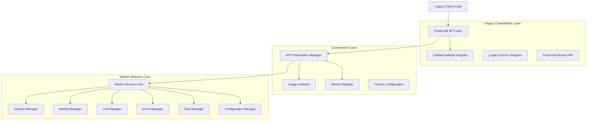

# Branch SDK Modernization: Delegate Pattern High-Level Design

**Document Type:** Architecture Design Document  
**Created:** June 2025  
**Last Updated:** June 2025  
**Version:** 1.0  
**Author:** Branch SDK Team  

---

## Executive Summary

This document presents the comprehensive high-level design for the Branch SDK modernization initiative. The modernization employs a sophisticated **Delegate Pattern** architecture to achieve a seamless transition from legacy synchronous APIs to a modern reactive architecture while maintaining 100% backward compatibility.

## High-Level Architecture



## Current State: Delegate Pattern Implementation

### 1. API Preservation Layer

The delegate pattern starts with comprehensive API preservation:

```kotlin
// Static method preservation
object PreservedBranchApi {
    @JvmStatic
    @Deprecated("Use ModernBranchCore.getInstance() instead")
    fun getInstance(): Branch {
        val result = preservationManager.handleLegacyApiCall(
            methodName = "getInstance",
            parameters = emptyArray()
        )
        return LegacyBranchWrapper.getInstance()
    }
}

// Instance method preservation
class LegacyBranchWrapper {
    @Deprecated("Use sessionManager.initSession() instead")
    fun initSession(activity: Activity): Boolean {
        return preservationManager.handleLegacyApiCall(
            methodName = "initSession",
            parameters = arrayOf(activity)
        ) as? Boolean ?: false
    }
}
```

### 2. Central Coordination Hub

The `BranchApiPreservationManager` serves as the central coordinator:

```kotlin
class BranchApiPreservationManager {
    fun handleLegacyApiCall(methodName: String, parameters: Array<Any?>): Any? {
        // 1. Record usage analytics
        recordApiUsage(methodName, parameters)
        
        // 2. Log deprecation warnings with migration guidance
        logDeprecationWarning(methodName)
        
        // 3. Delegate to modern implementation
        return delegateToModernCore(methodName, parameters)
    }
}
```

### 3. Modern Reactive Core

The target architecture uses modern patterns:

```kotlin
interface ModernBranchCore {
    val sessionManager: SessionManager
    val identityManager: IdentityManager
    val linkManager: LinkManager
    
    // Reactive state management
    val isInitialized: StateFlow<Boolean>
    val currentSession: StateFlow<BranchSession?>
    
    suspend fun initialize(context: Context): Result<Unit>
}
```

## Key Components

### 1. **Legacy Wrappers** (`/wrappers/`)
- **`PreservedBranchApi`**: Static method compatibility layer
- **`LegacyBranchWrapper`**: Instance method compatibility layer  
- **Responsibility**: Maintain exact API signatures while delegating to modern core

### 2. **Coordination Layer** (`/`)
- **`BranchApiPreservationManager`**: Central coordinator for all legacy API calls
- **Responsibility**: Route calls, track usage, provide deprecation guidance

### 3. **Modern Core** (`/core/`)
- **`ModernBranchCore`**: New reactive architecture with StateFlow and coroutines
- **`VersionConfiguration`**: Configurable deprecation and removal timelines
- **Responsibility**: Provide modern, efficient, testable implementation

### 4. **Adaptation Layer** (`/adapters/`)
- **`CallbackAdapterRegistry`**: Convert between legacy callbacks and modern reactive patterns
- **Responsibility**: Bridge callback-based APIs to modern async/reactive patterns

### 5. **Analytics & Registry** (`/analytics/`, `/registry/`)
- **`PublicApiRegistry`**: Catalog of all preserved APIs with version metadata
- **`ApiUsageAnalytics`**: Track usage patterns for migration planning
- **Responsibility**: Data-driven migration decisions and reporting

## Where We Want to Go

### Phase 1: Complete Legacy Preservation ✅ **(Current State)**

```kotlin
// ALL legacy APIs work exactly as before
Branch.getInstance().initSession(activity) // ✅ Works
Branch.getInstance().setIdentity("user123") // ✅ Works
```

- ✅ 100% API compatibility maintained
- ✅ Usage analytics and deprecation warnings implemented
- ✅ Version-specific deprecation timeline system
- ✅ Comprehensive API cataloging and reporting

### Phase 2: Modern API Adoption 🚧 **(In Progress)**

```kotlin
// Modern reactive APIs become available
val branchCore = ModernBranchCore.getInstance()

// Reactive session management
branchCore.sessionManager.currentSession.collect { session ->
    // React to session changes
}

// Coroutine-based operations
val result = branchCore.identityManager.setIdentity("user123")
```

**Goals:**
- 🎯 Modern APIs available alongside legacy
- 🎯 Progressive migration tools and guides
- 🎯 Reactive state management with StateFlow
- 🎯 Coroutine-based async operations

### Phase 3: Legacy Deprecation Timeline ⏳ **(Future)**

```kotlin
// Gradual API removal based on usage impact and complexity
// Critical APIs: 5.0.0 → 7.0.0 (extended support)
// Standard APIs: 5.0.0 → 6.0.0 (normal timeline)
// Problematic APIs: 4.0.0 → 5.0.0 (accelerated removal)
```

**Planned Timeline:**
- **v5.0.0**: Mass deprecation with clear migration paths
- **v6.0.0**: Remove standard APIs, keep critical ones
- **v7.0.0**: Remove remaining legacy APIs, pure modern architecture

### Phase 4: Pure Modern Architecture 🎯 **(End Goal)**

```kotlin
// Clean, modern, reactive-first API
class ModernBranchApp {
    private val branch = ModernBranchCore.getInstance()
    
    suspend fun initialize() {
        // Modern initialization
        branch.initialize(context).getOrThrow()
        
        // Reactive state observation
        branch.currentSession
            .filterNotNull()
            .collect { session ->
                handleSessionData(session)
            }
    }
    
    suspend fun createDeepLink(data: LinkData): String {
        return branch.linkManager
            .createShortLink(data)
            .getOrThrow()
    }
}
```

**End State Benefits:**
- 🎯 Pure reactive architecture with StateFlow
- 🎯 Coroutine-first async operations
- 🎯 Comprehensive error handling with Result types
- 🎯 Testable, maintainable, SOLID-compliant design
- 🎯 Modern Android development patterns

## Delegate Pattern Benefits

### 1. **Zero Breaking Changes**
- Legacy code continues working unchanged
- Gradual migration at developer's pace
- No forced upgrades or breaking changes

### 2. **Comprehensive Analytics**
- Track actual API usage patterns
- Data-driven deprecation decisions
- Usage heat maps for migration prioritization

### 3. **Controlled Migration**
- Version-specific deprecation timelines
- Impact-based removal scheduling
- Clear migration guidance and warnings

### 4. **Modern Architecture Foundation**
- Clean separation between legacy and modern
- SOLID principles applied throughout
- Testable and maintainable codebase

## Migration Strategy

### For SDK Maintainers

1. **Monitor Usage Analytics**
   ```kotlin
   val report = preservationManager.generateVersionTimelineReport()
   // Analyze API usage patterns
   // Adjust deprecation timelines based on data
   ```

2. **Provide Clear Migration Paths**
   ```kotlin
   // Each deprecated API includes specific guidance
   @Deprecated(
       message = "Use identityManager.setIdentity() instead",
       replaceWith = ReplaceWith("ModernBranchCore.getInstance().identityManager.setIdentity(userId)")
   )
   ```

3. **Gradual Feature Parity**
   - Implement modern equivalents for all legacy features
   - Ensure performance and reliability parity
   - Provide comprehensive documentation and examples

### For SDK Users

1. **Immediate**: No action required - all existing code continues working
2. **Short-term**: Start adopting modern APIs for new features
3. **Long-term**: Migrate existing code using provided tools and guidance

## Technical Excellence

### SOLID Principles Applied

- **Single Responsibility**: Each component has one clear purpose
- **Open/Closed**: Extensible for new features without modifying existing code
- **Liskov Substitution**: Legacy wrappers are perfect substitutes for original APIs
- **Interface Segregation**: Clean interfaces for each manager component
- **Dependency Inversion**: All components depend on abstractions, not concrete implementations

### Clean Architecture

```
┌─────────────────────────────────┐
│     Legacy API Compatibility    │  ← External Interface
├─────────────────────────────────┤
│     Preservation & Analytics     │  ← Application Layer
├─────────────────────────────────┤
│     Modern Business Logic       │  ← Domain Layer
├─────────────────────────────────┤
│     Reactive Infrastructure      │  ← Infrastructure Layer
└─────────────────────────────────┘
```

## Success Metrics

### Current Achievements ✅
- **100% API Compatibility**: All legacy APIs preserved and functional
- **Comprehensive Analytics**: Full usage tracking and reporting system
- **Flexible Versioning**: API-specific deprecation and removal timelines
- **Modern Foundation**: Clean, reactive architecture ready for adoption

### Future Targets 🎯
- **Migration Adoption**: Track modern API adoption rates
- **Performance Improvements**: Measure performance gains from modern architecture
- **Developer Experience**: Reduce integration complexity and improve debugging
- **Maintenance Overhead**: Decrease codebase complexity and improve maintainability

## Conclusion

The Branch SDK delegate pattern represents a sophisticated approach to API modernization that prioritizes developer experience while enabling technical excellence. By maintaining perfect backward compatibility while building a modern reactive foundation, we ensure a smooth transition that benefits both current and future users of the SDK.

This architecture demonstrates how legacy systems can be modernized without breaking existing integrations, providing a blueprint for other large-scale API modernization efforts. 