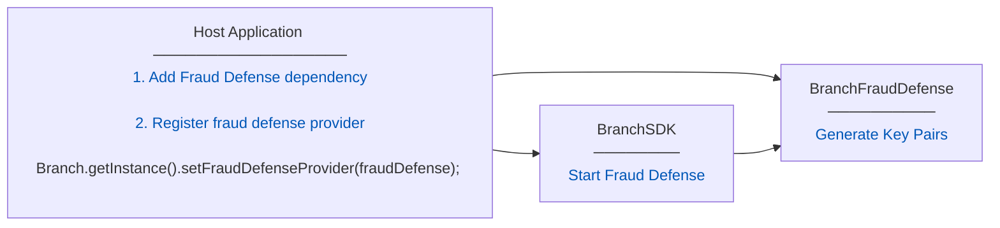
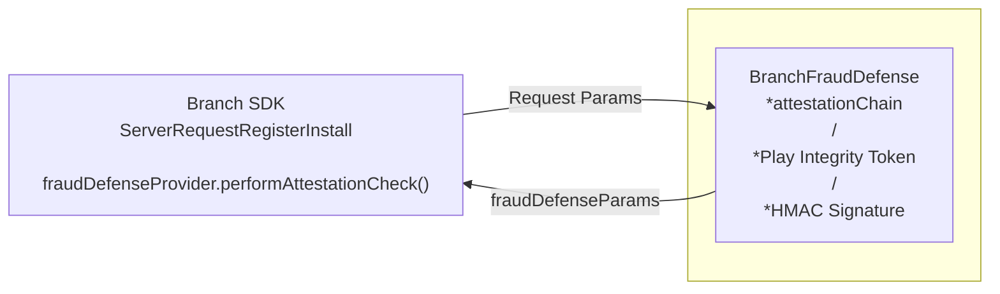

# [Android] Branch Fraud Defense Framework

Branch Fraud Defense Framework will provide client side implementation of all the three layers of Fraud Defense system for Android platform.

|  | Technologies | Frauds |
| --- | --- | --- |
| Layer 1: IDENTITY | Android Key Attestation, DH Key Exchange | SDK Spoofing, Replay Attacks, Message Tampering |
| Layer 2: ACTIVITY | HMAC, JWT | Message Tampering (example - Attribution Hijacking) SDK Spoofing (Identity) |
| Layer 3: FRESHNESS | Smart Nonces + TTL | Replay Events |

This will be a 

→ Private Library 

→ It will be available to client as a AAR (Android Archive) or via Maven/Gradle dependency.

→ Branch SDK will define an interface (protocol/contract) and this library will implement the interface. So Branch SDK will communicate with this library via interface.

## Client Side Architecture

The **BranchFraudDefense** library contains the complete implementation of the fraud defense system. It is responsible for generating and storing cryptographic keys, performing device attestation using Android Key Attestation (StrongBox/TEE) and Google Play Integrity API, and returning the attestation results as part of the Branch install request. It will also create HMAC signatures. All of this complexity is hidden inside the library — neither the Branch SDK nor the host app need to know how it works internally.

The **Branch SDK** and the **BranchFraudDefense** library do not depend on each other directly. Instead, they communicate through an interface, `BranchFraudDefenseProvider`, which is defined inside the Branch SDK. The interface acts as a contract — it defines what methods the SDK expects to call, without caring about who implements them or how. This means the Branch SDK can be built and shipped independently of the **BranchFraudDefense** library.

The **BranchFraudDefense** library provides a concrete implementation of this interface through the **BranchFraudDefense** class. When the Branch SDK needs to perform a fraud defense check during an install request, it calls the interface method — `performAttestationCheck` — without knowing anything about the attestation logic behind it.

The host application is responsible for connecting the two. At app launch, it sets the `BranchFraudDefense` singleton as the `fraudDefenseProvider` property on the Branch instance. This connects the two modules together. From that point on, the SDK automatically calls the fraud defense check on every install request and appends the returned fields — `app_ecdh_pub`, `key_attestation_chain`, `nonce`, `play_integrity_token`, and `ecdh_public_key` — to the outgoing request parameters.

### **Key Pair Generation**



### Request Params Attestation / Signing



## SDK - Interface

Branch SDK will define following interface.

```java
package io.branch.referral;

import org.json.JSONObject;

/**
 * Interface for fraud defense providers.
 *
 * This interface decouples the main Branch SDK from fraud defense implementations.
 * The SDK never imports concrete fraud defense classes (e.g., BranchFraudDefense) -
 * it only knows this interface.
 */
public interface BranchFraudDefenseProvider {
    /**
     * Perform fraud defense checks and return fields to add to request.
     *
     * Called by ServerRequestRegisterInstall before sending v1/install request.
     *
     * @param requestBody Current request body (before fraud defense fields)
     * @return JSONObject with fraud defense fields to merge, or null if unavailable
     */
    JSONObject performAttestationCheck(JSONObject requestBody);
}
```

Branch SDK will provide following API for **dependency injection.** Customer app will create an instance of **`BranchFraudDefense`** and pass it to Branch SDK through this API. This property `fraudDefenseProvider` will be used later by the SDK to call API `performAttestationCheck` of **`BranchFraudDefense`** to create attestation object and HMAC signature for request params.

```java
// In Branch class
public void setFraudDefenseProvider(BranchFraudDefenseProvider fraudDefenseProvider) {
    this.fraudDefenseProvider_ = fraudDefenseProvider;
}
```

SDK will call API `performAttestationCheck` in current SDK class `ServerRequestRegisterInstall` (which creates request body params)

```java
// In ServerRequestRegisterInstall.onRequestSucceeded()
@Override
protected void setPost(JSONObject post) throws JSONException {
    super.setPost(post);
    
    // Add fraud defense fields if provider is configured
    if (Branch.getInstance().getFraudDefenseProvider() != null) {
        try {
            JSONObject fraudDefenseParams = Branch.getInstance()
                .getFraudDefenseProvider()
                .performAttestationCheck(post);
            
            if (fraudDefenseParams != null) {
                Iterator<String> keys = fraudDefenseParams.keys();
                while (keys.hasNext()) {
                    String key = keys.next();
                    post.put(key, fraudDefenseParams.get(key));
                }
            }
        } catch (Exception e) {
            PrefHelper.Debug("Fraud defense check failed: " + e.getMessage());
        }
    }
}
```

## Branch Fraud Defense APIs

Branch Fraud Defense Framework will provide implementation of BranchFraudDefenseProvider.

### 1. KEY GENERATION API - startFraudDefenseSystem

This API will be called by the app at startup.

```kotlin
startFraudDefenseSystem()
  └── getOrCreateEcdhPublicKey()
        Check AndroidKeyStore for existing key (ECDH_KEY_ALIAS)
        If missing:
          KeyPairGenerator.getInstance(EC, "AndroidKeyStore")
          Generate P-256 key pair
          Store private key in AndroidKeyStore (permanent)
          Return public key bytes (DER-encoded)
        If exists:
          Return existing public key from keystore
```

Key generation is synchronous but cached after first call. The private key never leaves the AndroidKeyStore hardware.

### 2. Attestation - performAttestationCheck

This will be called by Branch SDK when creating INSTALL request.

```kotlin
performAttestationCheck(requestBody: JSONObject)
  ├── Try Hardware Attestation (API 24+)
  │   ├── getOrCreateEcdhPublicKey() → ecdhPubKeyBytes
  │   ├── generateRandomNonce() → 32 random bytes
  │   ├── buildChallenge:
  │   │     1. Build canonical query string from requestBody
  │   │     2. Sort params keys alphabetically
  │   │     3. Serialize as "key1=val1&key2=val2&..."
  │   │     4. Concatenate: canonical_params_utf8 + ecdhPublicKeyBytes + randomNonceBytes
  │   │     5. SHA-256 → challenge (32 bytes)
  │   ├── generateAttestedKeyPair(challenge):
  │   │     1. Check StrongBox availability (API 28+)
  │   │     2. KeyGenParameterSpec.Builder(KEY_ALIAS, ...)
  │   │          .setAttestationChallenge(challenge)
  │   │          .setIsStrongBoxBacked(true)  ← if available
  │   │     3. KeyPairGenerator.generateKeyPair()
  │   │     4. Retrieve certificate chain from AndroidKeyStore
  │   └── Return {
  │         app_ecdh_pub: Base64(leaf.publicKey),
  │         key_attestation_chain: [Base64(cert[0]), Base64(cert[1]), ...],
  │         nonce: Base64(randomNonce),
  │         ecdh_public_key: Base64(ecdhPubKeyBytes)
  │       }
  │
  └── Fallback to Play Integrity (if hardware fails or API < 24)
      ├── getOrCreateEcdhPublicKey() → ecdhPubKeyBytes
      ├── generateRandomNonce() → 32 random bytes
      ├── buildChallenge → same as hardware path
      ├── Base64url encode challenge → nonceBase64url
      ├── PlayIntegrityWrapper.requestToken(context, nonceBase64url)
      │     IntegrityManagerFactory.create(context)
      │     IntegrityTokenRequest.builder()
      │       .setNonce(nonceBase64url)
      │       // No setCloudProjectNumber(): supplying one switches Play Integrity to
      │       // Google-managed response encryption. We use self-managed keys, so the
      │       // token is decrypted locally with our DECRYPTION_KEY/VERIFICATION_KEY.
      │       .build()
      │     Wait for token (blocking)
      └── Return {
            play_integrity_token: token,
            nonce: Base64(randomNonce),
            ecdh_public_key: Base64(ecdhPubKeyBytes)
          }
```

**Graceful Degradation:**
- If both hardware attestation and Play Integrity fail, return `null`
- SDK continues to function normally without fraud defense fields
- Install request is sent without attestation

### 3. HMAC Request Signing - createHMACSignatureForParams

**(Future Implementation - Layer 2)**

This will be called by Branch SDK when creating v1/open and v2/event requests.

```kotlin
createHMACSignatureForParams(params: JSONObject)
  ├── Generate smart_nonce: "<unix_timestamp>|<SecureRandom 16 bytes base64url>"
  ├── Extract timestamp from smart_nonce (first segment)
  ├── Build canonical string:
  │     1. Sort params keys alphabetically
  │     2. Serialize as "key1=val1&key2=val2&..."
  │     3. Append "&nonce=<smart_nonce>&timestamp=<timestamp>"
  ├── Load hmac_secret from AndroidKeyStore (or SharedPreferences encrypted)
  ├── HMAC-SHA256(canonical_string_utf8, hmac_secret) → raw_signature (32 bytes)
  └── Return { signature_b64: Base64(raw_signature), smart_nonce }
```

## App Integration

→ App Developers will add BranchFraudDefense Library via Gradle dependency.

→ App Developers will also integrate Branch SDK.

→ App Developers will call following API to register this BranchFraudDefense Library with Branch SDK.

```kotlin
import io.branch.frauddefense.BranchFraudDefense
import io.branch.referral.Branch

class MyApplication : Application() {
    override fun onCreate() {
        super.onCreate()

        // Initialize fraud defense
        val fraudDefense = BranchFraudDefense.getInstance(this)
        fraudDefense.startFraudDefenseSystem()

        // Initialize Branch SDK
        val branch = Branch.getAutoInstance(this)

        // Register the fraud defense provider
        branch.setFraudDefenseProvider(fraudDefense)
    }
}
```

**Java Example:**
```java
import io.branch.frauddefense.BranchFraudDefense;
import io.branch.referral.Branch;

public class MyApplication extends Application {
    @Override
    public void onCreate() {
        super.onCreate();

        // Initialize fraud defense
        BranchFraudDefense fraudDefense = BranchFraudDefense.getInstance(this);
        fraudDefense.startFraudDefenseSystem();

        // Initialize Branch SDK
        Branch branch = Branch.getAutoInstance(this);

        // Register the fraud defense provider
        branch.setFraudDefenseProvider(fraudDefense);
    }
}
```

Once Branch SDK gets instance of this library, it will do the rest of the job.

## Android-Specific Implementation Details

### Hardware Attestation (Layer 1)

**Technology:** Android Key Attestation with StrongBox/TEE

**Requirements:**
- Minimum API Level: 24 (Android 7.0 Nougat)
- StrongBox preferred (API 28+, Android 9.0 Pie)
- Falls back to TEE if StrongBox unavailable

**Security Levels:**
- `STRONGBOX`: Dedicated secure chip (Titan M, etc.) - strongest protection
- `TRUSTED_ENVIRONMENT`: TEE-backed (hardware isolated) - acceptable
- `SOFTWARE`: Reject for fraud prevention - not trustworthy

**Key Features:**
- Keys stored in AndroidKeyStore (hardware-backed)
- Private keys never leave secure hardware
- Certificate chain signed by Google Hardware Attestation Root CA
- Attestation extension contains device and app integrity proof

**Certificate Chain Structure:**
```
chain[0]: Leaf certificate (contains app_ecdh_pub + attestation extension)
chain[1]: Intermediate certificate
chain[2]: Google Hardware Attestation CA
chain[3]: Google Hardware Attestation Root CA
```

**Attestation Extension Verification:**
- Attestation challenge must match: SHA-256(canonical_params || ecdh_pub || nonce)
- Package name must match app's package
- Security level must be STRONGBOX or TRUSTED_ENVIRONMENT
- Verified boot state must be VERIFIED (bootloader locked)
- Device must be locked (device_locked = true)

### Play Integrity API (Layer 1 - Fallback)

**Technology:** Google Play Integrity API

**Requirements:**
- App uploaded to Google Play Console (internal testing sufficient)
- Google Play Services installed on device
- Play Integrity API enabled in Google Cloud Console
- Cloud Project linked to Play Console app

**Token Format:** JWE (JSON Web Encryption)
- Encrypted by Google, can only be decrypted by authorized backend
- Contains app, device, and account integrity verdicts
- Prevents client-side tampering

**Verdicts Provided:**
- `appIntegrity`: App recognition (PLAY_RECOGNIZED, UNRECOGNIZED_VERSION, UNEVALUATED)
- `deviceIntegrity`: Device state (MEETS_STRONG_INTEGRITY, MEETS_DEVICE_INTEGRITY, MEETS_BASIC_INTEGRITY, or empty)
- `accountDetails`: User account status (LICENSED, UNLICENSED, UNEVALUATED)

**Integration Setup:**
1. Upload signed app to Play Console
2. Link Play Console to Google Cloud Project
3. Enable Play Integrity API in Cloud Console
4. Wait 1-2 hours for propagation

**Backend Verification:**
- Branch backend calls Google's Play Integrity API to decrypt token
- Branch manages quota centrally (no vendor action needed)
- Token contains nonce derived from request payload for replay protection

### Challenge/Nonce Binding

**Purpose:** Binds attestation to specific request, prevents replay attacks

**Challenge Derivation:**
```
canonical_params = sorted keys + values serialized as "key1=val1&key2=val2&..."
challenge = SHA-256(canonical_params_utf8 || ecdh_public_key_bytes || random_nonce_bytes)
```

**For Hardware Attestation:**
- Challenge embedded in certificate's attestation extension
- Server verifies by recomputing challenge from request params

**For Play Integrity:**
- Challenge base64url-encoded and passed as nonce to Play Integrity API
- Server decrypts token and verifies nonce matches

**Fields in Request:**
- `nonce`: Base64-encoded random 32 bytes (sent in plaintext for server verification)
- Attestation challenge uses SHA-256 of (canonical params + ecdh key + nonce)

## Comparison: Android vs iOS Implementation

| Feature | Android | iOS |
|---------|---------|-----|
| **Primary Technology** | Android Key Attestation (StrongBox/TEE) | App Attest (DCAppAttestService) |
| **Fallback** | Google Play Integrity API | N/A |
| **Key Storage** | AndroidKeyStore (hardware-backed) | Keychain (hardware-backed) |
| **Minimum OS Version** | API 24 (Android 7.0) | iOS 14+ |
| **Secure Hardware** | StrongBox (API 28+) or TEE | Secure Enclave |
| **Certificate Chain** | X.509 chain (Google root CA) | Attestation object (Apple format) |
| **Store Requirement** | Optional (hardware attestation works without) Required for Play Integrity | App Store Connect upload required |
| **Interface Pattern** | `BranchFraudDefenseProvider` (Java interface) | `BranchFraudDefenseProtocol` (Objective-C protocol) |
| **Distribution** | AAR via Maven/Gradle | xcframework via SPM |
| **Language** | Kotlin | Objective-C/Swift |
| **Key Generation** | KeyPairGenerator + AndroidKeyStore | SecKeyCreateRandomKey |
| **Attestation Call** | Synchronous (blocking) | Asynchronous (completion handler) |
| **Graceful Degradation** | Yes (returns null if unavailable) | Yes (returns empty dict if unavailable) |

## Questions

- **Unauthorized Binary Redistribution** - If this library is delivered to customers as binary (AAR), how can we ensure client does not share it with other users/vendors?
- What will happen if attestation APIs fail? Branch SDK will retry or send requests without these params? In case of Error, which request passes failure reason to Branch Backend?
- What will happen if network or communication fails when request is coming back from Gateway to SDK? Similar to Caching Issue (INTENG)
- Name of the Library? (Currently: `BranchFraudDefense`)
- Request Body New Fields Name. (SDK - Backend Contract for name and type of fields)
- This Library will use logging of Branch SDK or will have a separate logging APIs?
- Play Integrity quota management - should vendors be aware of quota limits? (Currently: Branch manages quota centrally)
- Should we support both AAR distribution and source code integration?
- Certificate pinning for Google Hardware Attestation Root CA - how to handle root rotation (deadline: March 31, 2026)?
- Key alias naming convention - should we namespace per app or use fixed aliases?
- Error reporting to backend - should failed attestation attempts be logged to Branch servers for monitoring?

## Backend Verification Requirements

### Hardware Attestation Verification (Server-Side)

The Branch backend must verify the hardware attestation certificate chain:

1. **Certificate Chain Validation:**
   - Verify each certificate is signed by the next in chain
   - Verify root certificate against Google Hardware Attestation Root CA
   - Check certificate revocation status (CRL)
   - **CRITICAL:** Trust both old and new root certificates (transition by March 31, 2026)

2. **Attestation Extension Parsing:**
   - Extract attestation extension from leaf certificate (OID: 1.3.6.1.4.1.11129.2.1.17)
   - Use Google's official library: `com.google.android.attestation:attestation:1.0.0`
   - Parse `ParsedAttestationRecord`

3. **Challenge Verification:**
   - Rebuild canonical query string from request params (excluding attestation fields)
   - Recompute: SHA-256(canonical_params_utf8 || ecdh_public_key_bytes || decoded_nonce)
   - Compare with `attestationChallenge` in certificate extension
   - Must match exactly

4. **Security Level Check:**
   - `keymintSecurityLevel` must be `TRUSTED_ENVIRONMENT` or `STRONGBOX`
   - Reject `SOFTWARE` level (not hardware-backed)

5. **Boot State Verification:**
   - `verifiedBootState` must be `VERIFIED` (reject `UNVERIFIED` or `SELF_SIGNED`)
   - `deviceLocked` must be `true`

6. **App Identity Verification:**
   - `attestationApplicationId.packageInfos[0].packageName` must match expected package
   - Prevents different app on same device from using attestation

7. **Public Key Binding:**
   - Extract public key from leaf certificate
   - Compare with `app_ecdh_pub` field in request
   - Must match exactly

8. **Nonce Burning:**
   - Store nonce in Redis with TTL (e.g., 60 seconds)
   - Mark as used after successful verification
   - Reject reused nonces (replay protection)

### Play Integrity Verification (Server-Side)

The Branch backend must decrypt and verify the Play Integrity token:

1. **Token Decryption:**
   - Call Google's Play Integrity API: `POST https://playintegrity.googleapis.com/v1/{package_name}:decodeIntegrityToken`
   - Use service account credentials with `playintegrity` scope
   - Receive decrypted verdict

2. **Nonce Verification:**
   - Rebuild canonical query string from request params
   - Recompute: SHA-256(canonical_params_utf8 || ecdh_public_key_bytes || decoded_nonce)
   - Base64url encode
   - Compare with `tokenPayloadExternal.requestDetails.nonce`

3. **Verdict Analysis:**
   - **App Integrity:** `appRecognitionVerdict` = `PLAY_RECOGNIZED` (best case)
   - **Device Integrity:** Look for `MEETS_STRONG_INTEGRITY` or `MEETS_DEVICE_INTEGRITY`
   - **Account Details:** `appLicensingVerdict` = `LICENSED`

4. **Risk Scoring:**
   - Assign risk scores based on verdict combinations
   - High confidence: `PLAY_RECOGNIZED` + `MEETS_STRONG_INTEGRITY`
   - Medium risk: `UNRECOGNIZED_VERSION` + `MEETS_DEVICE_INTEGRITY`
   - High risk: Empty device integrity array (rooted/modified device)

5. **Timestamp Check:**
   - Verify `timestampMillis` is recent (within acceptable window)
   - Prevents token replay

6. **Package Name Verification:**
   - `requestPackageName` must match expected package

## Implementation Roadmap

### Phase 1: Layer 1 - Identity (Current)
- ✅ Android Key Attestation (StrongBox/TEE)
- ✅ Play Integrity API fallback
- ✅ Interface definition in Branch SDK
- ✅ Key generation and storage
- ✅ Challenge/nonce binding
- ✅ Backend verification (hardware attestation)
- ✅ Backend verification (Play Integrity)

### Phase 2: Layer 2 - Activity
- ⏳ HMAC request signing for v1/open
- ⏳ HMAC request signing for v2/event
- ⏳ JWT token generation
- ⏳ Diffie-Hellman key exchange
- ⏳ Shared secret derivation
- ⏳ Backend HMAC verification

### Phase 3: Layer 3 - Freshness
- ⏳ Smart nonce generation
- ⏳ Server-provided nonces
- ⏳ TTL enforcement
- ⏳ Nonce burning (prevent replay)
- ⏳ Timestamp validation

### Phase 4: Distribution & Documentation
- ⏳ AAR packaging
- ⏳ Maven/Gradle publishing
- ⏳ ProGuard/R8 rules
- ⏳ Integration documentation
- ⏳ Sample app
- ⏳ Troubleshooting guide

## Security Considerations

### Key Storage
- All cryptographic keys stored in AndroidKeyStore
- Hardware-backed keys (StrongBox/TEE) cannot be extracted
- Keys bound to app's signing certificate
- Keys deleted if app is uninstalled

### Request Binding
- Nonce derived from request payload
- Prevents replay attacks
- Ensures attestation is specific to this request
- Server recomputes and verifies challenge

### Privacy
- No Personally Identifiable Information (PII) included
- Device identifiers not sent (only cryptographic proofs)
- Only integrity verdicts transmitted
- GDPR/privacy-compliant

### Certificate Pinning
- Google Hardware Attestation Root CA must be trusted
- Root certificate rotation in progress (deadline: March 31, 2026)
- Backend must trust both old and new roots during transition

### Graceful Degradation
- Library never blocks SDK functionality
- Returns null if attestation unavailable
- SDK continues without fraud defense fields
- Logs warnings but doesn't throw exceptions

### Proguard/R8
- Keep rules required for Play Integrity API
- AndroidKeyStore classes must not be obfuscated
- Certificate parsing classes must be preserved
